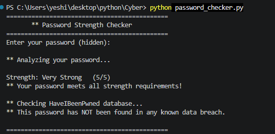
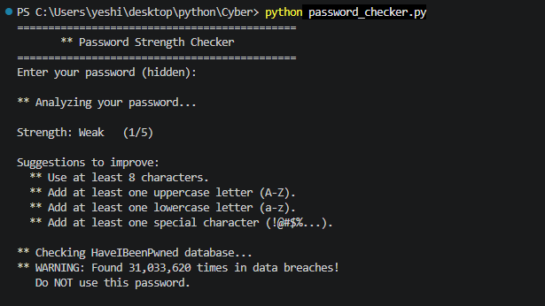

# 🔐 Password Strength Checker

A Python tool that checks your password strength and whether it has appeared in known data breaches using the [HaveIBeenPwned API](https://haveibeenpwned.com/).

## 📋 Table of Contents
 
- [Features](#-features)
- [How It Works](#-how-it-works)
- [Technologies Used](#-technologies-used)
- [Getting Started](#-getting-started)
- [Usage](#-usage)
- [Project Structure](#-project-structure)
- [Concepts Learned](#-concepts-learned)
- [Preview](#-preview)


---
 
## ✨ Features
 
- ✅ **Real-time strength analysis** — checks length, uppercase, lowercase, numbers and symbols
- ✅ **Breach database check** — verifies against 10 billion leaked passwords
- ✅ **k-Anonymity protection** — your actual password never leaves your device
- ✅ **Score system** — rates password from 0 to 5 with labels
- ✅ **Helpful suggestions** — tells you exactly what to improve
- ✅ **Hidden input** — password is invisible while typing
---

## 🔍 How It Works
 
### Strength Checker
The tool checks your password against **5 rules:**
 
| Rule | Requirement |
|---|---|
| ✅ Length | At least 8 characters |
| ✅ Uppercase | At least one capital letter (A–Z) |
| ✅ Lowercase | At least one small letter (a–z) |
| ✅ Number | At least one digit (0–9) |
| ✅ Symbol | At least one special character (!@#$...) |
 
Each rule passed adds **1 point** to the score (max = 5):
 
| Score | Label |
|---|---|
| 0 | Very Weak  |
| 1 | Weak  |
| 2 | Fair  |
| 3 | Moderate  |
| 4 | Strong  |
| 5 | Very Strong  |
---
 
### Breach Checker — k-Anonymity
 
This is the privacy trick that keeps your password safe during the API check:
 
```
Step 1:  Your password is hashed locally using SHA-1
         "hello123" → "F9EF2CDDCA42A2E78A4F8F..."
 
Step 2:  The hash is split into two parts
         Prefix (first 5 chars):  "F9EF2"   ← sent to API
         Suffix (remaining chars): "CDDCA..." ← stays on your device
 
Step 3:  The API returns ALL hashes starting with "F9EF2"
         (thousands of hashes mixed together)
 
Step 4:  Your code checks locally if your suffix is in that list
         Match found  → password was leaked 🚨
         No match     → password is safe   ✅
```
> Your actual password **never leaves your computer.** Only 5 characters of a hash are sent — shared by thousands of other hashes.

---
 
## 🛠️ Technologies Used
 
| Tool | Purpose |
|---|---|
| `Python 3` | Core programming language |
| `re` | Regular expressions for pattern matching |
| `hashlib` | SHA-1 hashing algorithm |
| `getpass` | Hidden password input |
| `requests` | HTTP requests to HaveIBeenPwned API |
| [HaveIBeenPwned API](https://haveibeenpwned.com/API/v3) | Breach database with 10B+ passwords |
 
---
## 🚀 Getting Started
 
### Prerequisites
 
Make sure you have Python installed:
```bash
python --version
```
You should see `Python 3.x.x`
 
### Installation
 
**1. Clone the repository**
```bash
git clone https://github.com/yeshith-gune/password-checker.git
cd password-checker
```
 
**2. Install the required library**
```bash
pip install requests
```
 
**3. Run the program**
```bash
python password_checker.py
```
---

## 💻 Usage
 
When you run the program you will see:
 
```
=============================================
       🔐 Password Strength Checker
=============================================
Enter your password (hidden):
 
🔍 Analyzing your password...
 
Strength: Strong 🟢  (4/5)
 
Suggestions to improve:
  ❌ Add at least one special character (!@#$%...).
 
🌐 Checking HaveIBeenPwned database...
✅ This password has NOT been found in any known data breach.
 
=============================================
```
### Example Results
 
| Password | Score | Breach Safe? |
|---|---|---|
| `password` | Very Weak 🔴 | 🚨 Found 9M+ times |
| `Hello123` | Moderate 🟡 | ✅ Not found |
| `Hello@123!` | Strong 🟢 | ✅ Not found |
| `H3ll0@W0rld#2024` | Very Strong 💪 | ✅ Not found |
 
---
## 📁 Project Structure
 
```
password-checker/
│
├── password_checker.py    ← main Python script
├── README.md              ← this file
├── .gitignore             ← files ignored by Git
└── assets/
    ├── screenshot.PNG     ← terminal screenshot 1
    └── screenshot1.PNG    ← terminal screenshot 2
```
 
---
## 🧠 Concepts Learned
 
Building this project taught me:
 
- **Python functions** — writing reusable blocks of code with `def`
- **Regular Expressions** — searching for patterns in text using `re`
- **SHA-1 Hashing** — converting text into a one-way scrambled code
- **k-Anonymity** — a real-world privacy technique used in security tools
- **HTTP Requests** — communicating with external APIs using `requests`
- **Try/Except** — handling errors gracefully without crashing
- **f-strings** — embedding variables directly inside text
- **Lists & Dictionaries** — storing and looking up data in Python
- **Git & GitHub** — version control and pushing projects online
---


## Preview




---

## 🔒 Security Note
 
This tool is built for **educational purposes** — to help you understand what makes a strong password. Never store or log real passwords anywhere. Always use a trusted password manager for your actual passwords.
 
---
<div align="center">
  <i>⭐ Star this repository if you found it helpful!</i>
</div>
